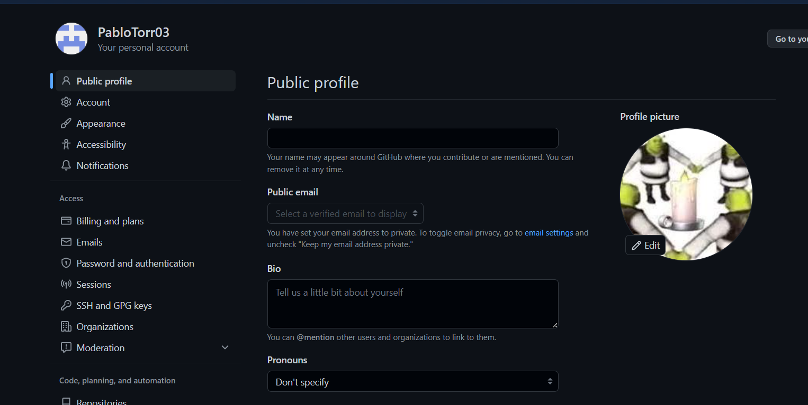
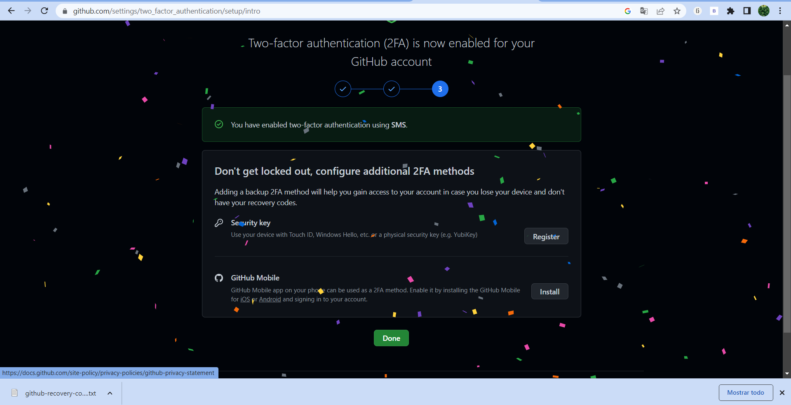
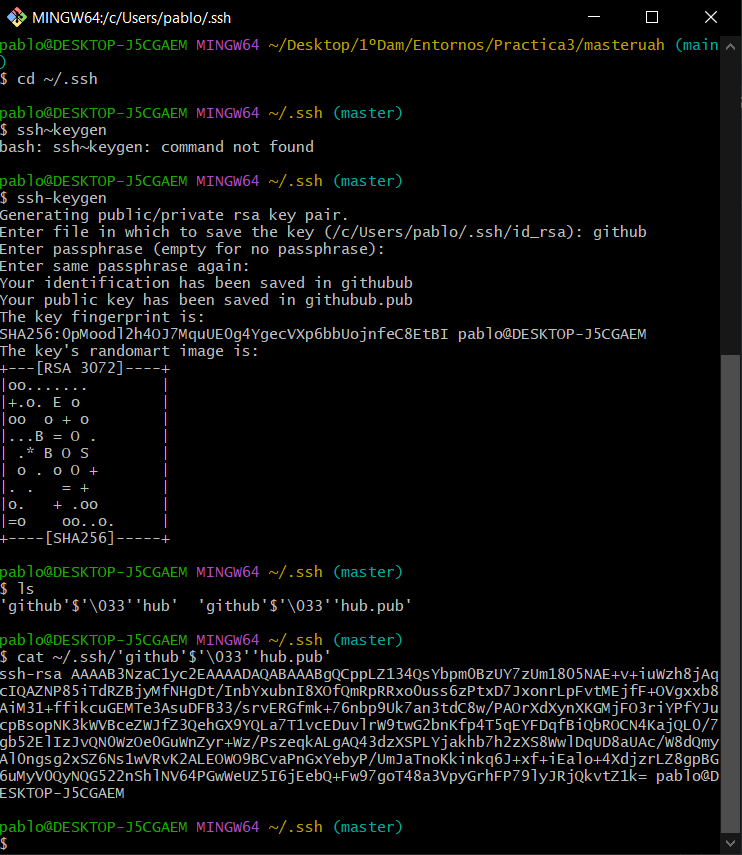
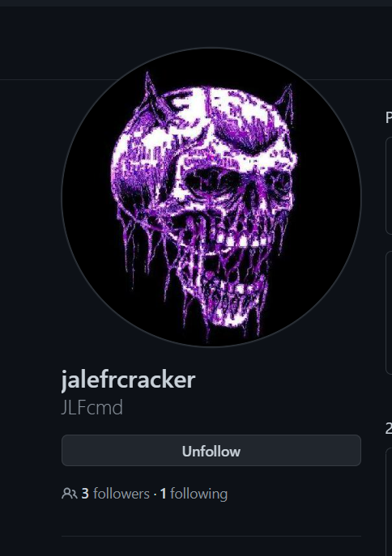
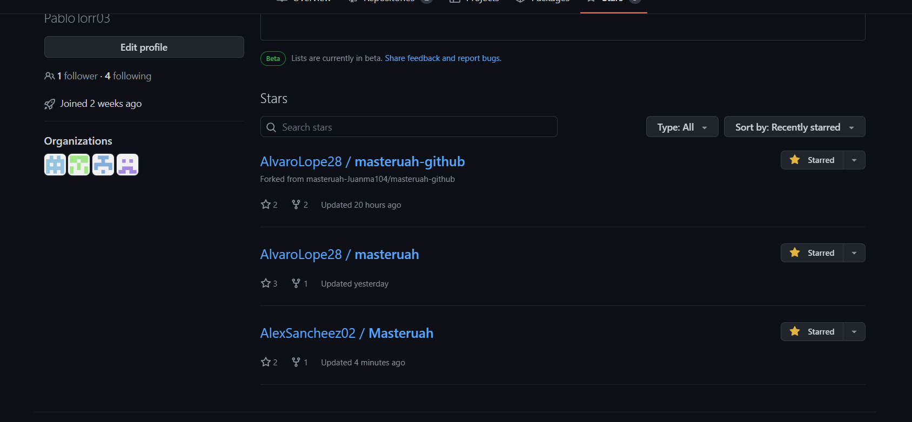
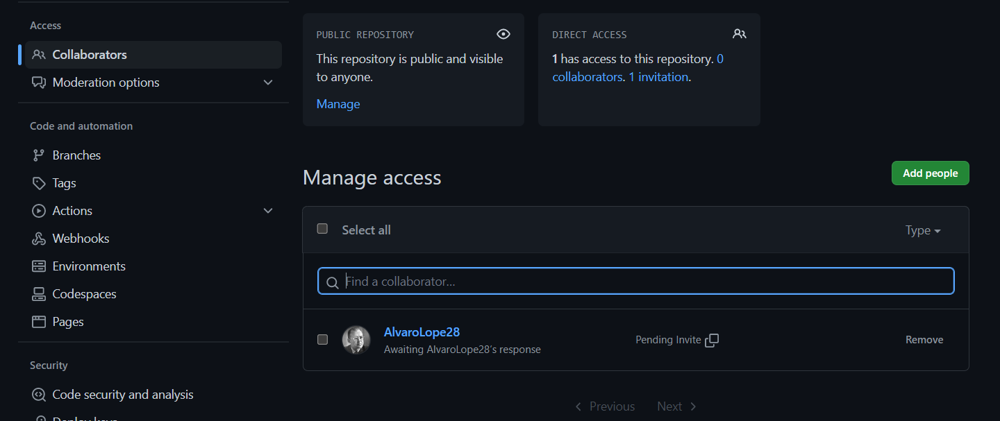
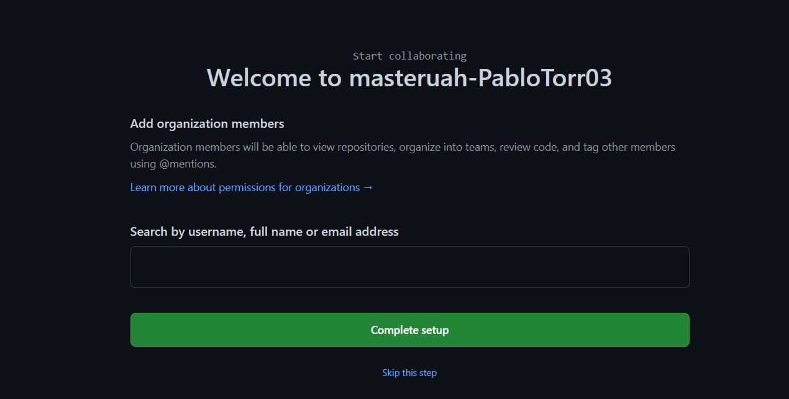
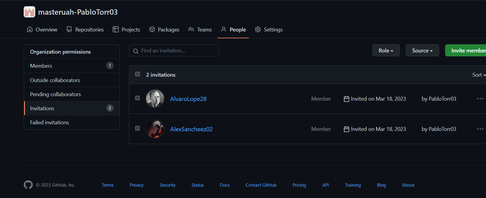
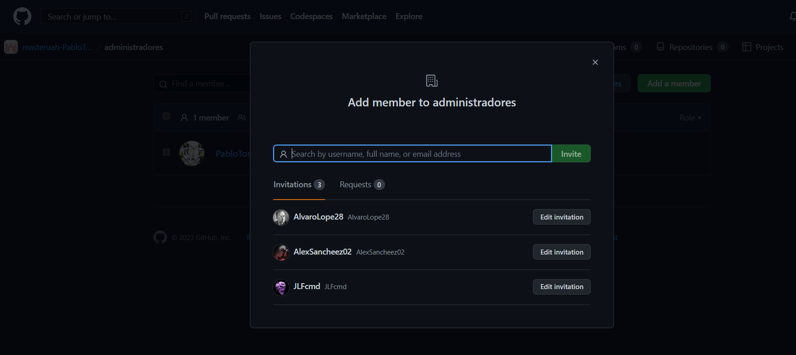
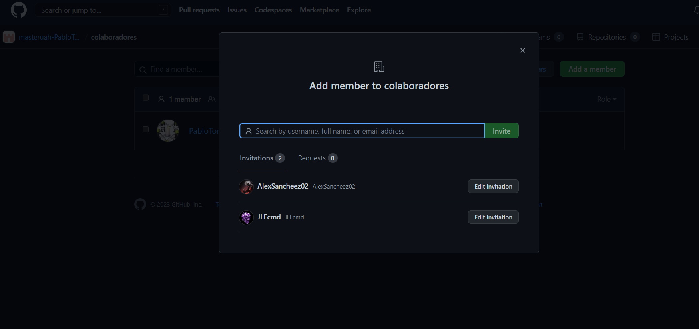

# masteruah
 
<ol>
    <li>
    Creamos un repositorio en github poniendole el nombre masteruah y despues creamos en nuestro equipo una carpeta con el mismo nombre y lanzamos la carpeta con git.
    </li>
    <li>
    Escribimos el comando git clone con la url del repositorio para clonar el repositorio en la carpeta creada en el dispositivo (git clone https://github.com/PabloTorr03/masteruah).
    </li>
    <li>
    Hacedemos a la carpeta interna con el comando cd masteruah.
    </li>
    <li>
    Para actualizar readme.md utilizamos el comando git add README.md.
    </li>
    <li>
    Para escribir un mensaje en el readme escribimos el comando git commit -m "commit inicial". 
    </li>
    <li>
    Para subir los cambios al repositorio remoto utilizamos el comando git push.
    </li>
    <li>
    Para añadir fichero **1.txt** al repositorio local utilizamos el comando git add 1.txt. Y le hacemos un commit, git commit -m "añadir 1.txt". Para comprobar si se ha añadido corretamente utilizamos git log.
    </li>
    <li>
    Para crear el tag **v0.1** utilizamos el comando git tag v0.1. Y para subirlo utilizamos git push --tags.
    </li>
    <li>
    Con el comando git branch creamos una rama (git branch v0.2). Para posicionarnos en la rama creada utilizamos git checkout v0.2. Para añadir un fichero dentro de la rama v0.2 utilizamos el comando echo "Contenido del fichero 2" > 2.txt. Y para agregarlo utilizamos git add 2.txt y git commit -m "Añadir fichero 2.txt a la rama v0.2".
    </li>
    <li>
    Para añadir los cambios al repositorio remoto utilizamos el comando git push -u origin v0.2.
    </li>
    <li>
    Para posicionarnos en la rama main utilizamos git checkout main. Par poder hacer un merge en la rama v0.2 en la rama main el comando git merge v0.2, despues de esto cambiamos algo de texto del fichero 1.txt y le hacemos el commit para ello le hacemos primero git add fichero 1.txt y el comando git commit -m "agregando hola en el fichero 1.txt".
    </li>
    <li>
    Nos posicionamos en la rama v0.2 con el comando git checkout v0.2 y escribe en fichero 1.txt con el comando echo "Adios" > 1.txt, y lo añadimos con git add 1.txt y lo añadimos con el comando git commit -m "agrgando adios al fichero 1.txt en la rama v0.2"
    </li>
    <li>
    Cambiamos de rama git checkout main para hacer un merge entre las dos (git merge v0.2) dando un conflicto entre las dos ramas, para solucionarlo primero encontramos el fallo con git status y para resolver el fallo utilizazmos el comando vim 1.txt para solucionar el fallo elegimos entre una de las dos ramas lo que es correcto y escribimos wq para salir. Despues de terminar de reparar el fallo utilizamos git commit -m "Resuelto conflicto en fichero 1.txt". 
    </li>
    <li>
    Despues de resolver el fallo creamos el tag v0.2 y borramos la rama con git branch -D v0.2. Para encontrar el listado de cambios utilizamos el comando git log --one line --decorate --all 
    </li>
    <li>
    CAMBIAR FOTO PERFIL
    
    </li>
    <li>
    DOBLE FACTOR DE IDENTIFICACIÓN
    
    </li>
    <li>
    CLAVE PUBLICA PC
    </li>
    
    <li>
    AMIGOS
    </li>
    
    <li>
    ESTRELLA REPOSITORIOS
    </li>
    
    <li>
    TABLA
    </li>
    <table>
    <tr>
    <th>NOMBRE</th>
    <th>GITHUB</th>
    </tr>
    <tr>
    <td>AlexSancheez02</td>
    <td>https://github.com/AlexSancheez02</td>
    </tr>
    <tr>
    <td>jalefrcracker</td>
    <td>https://github.com/JLFcmd</td>
    </tr>
    </table>
    <li>
    COLABORADORES
    </li>
    
    <li>
    ORGANIZACIÓN
    </li>
    
    <li>
    MIEMBROS
    </li>
    
    <li>
    INDEX.MD
    </li>
    
    <li>
    
    </li>
    <li>
    
    </li>
</ol>

